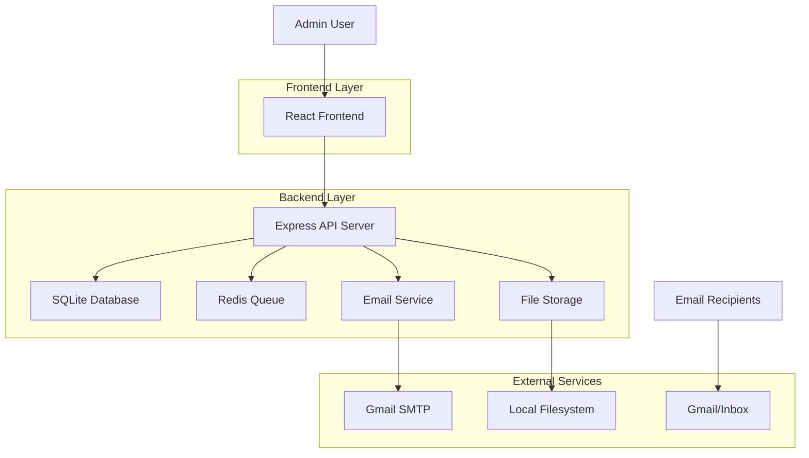
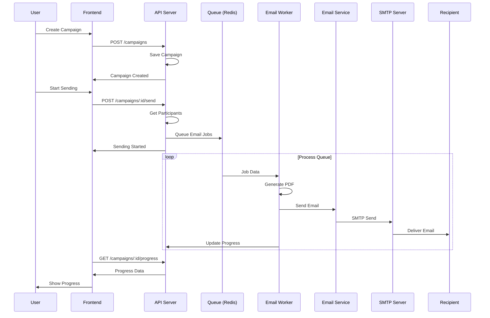
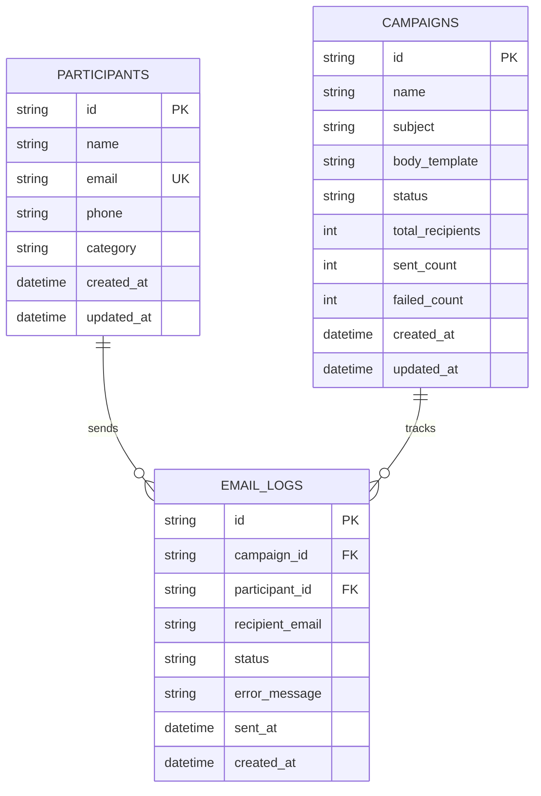
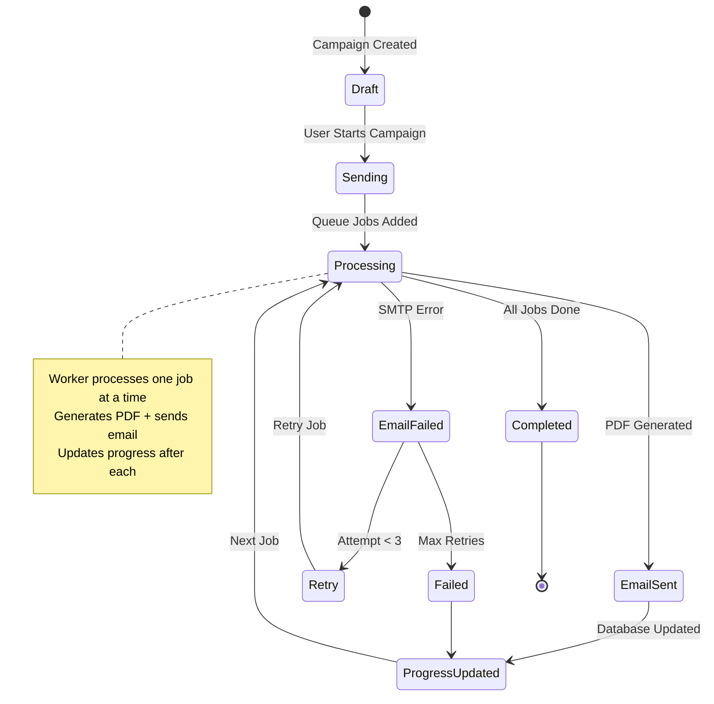
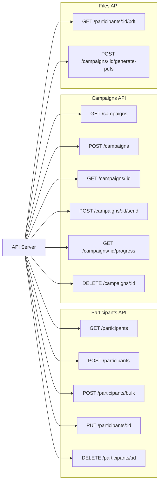
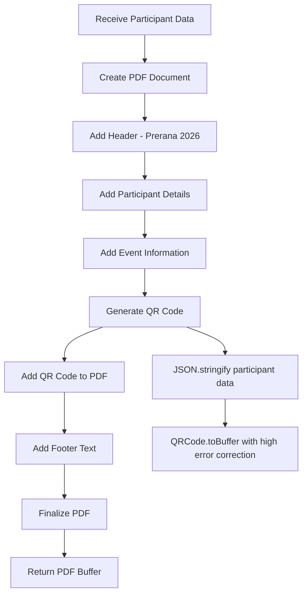
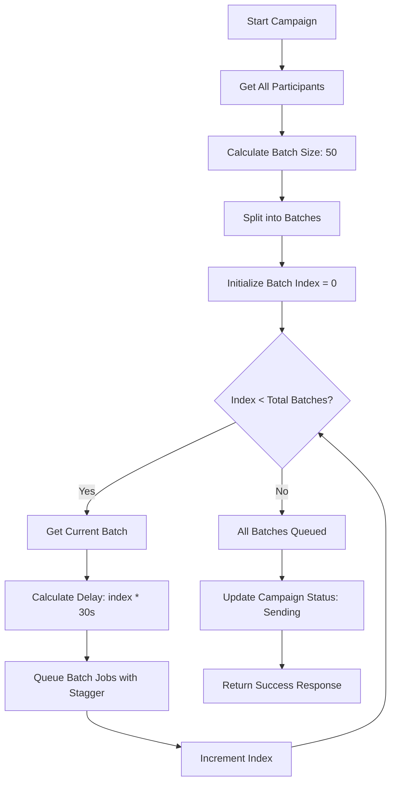
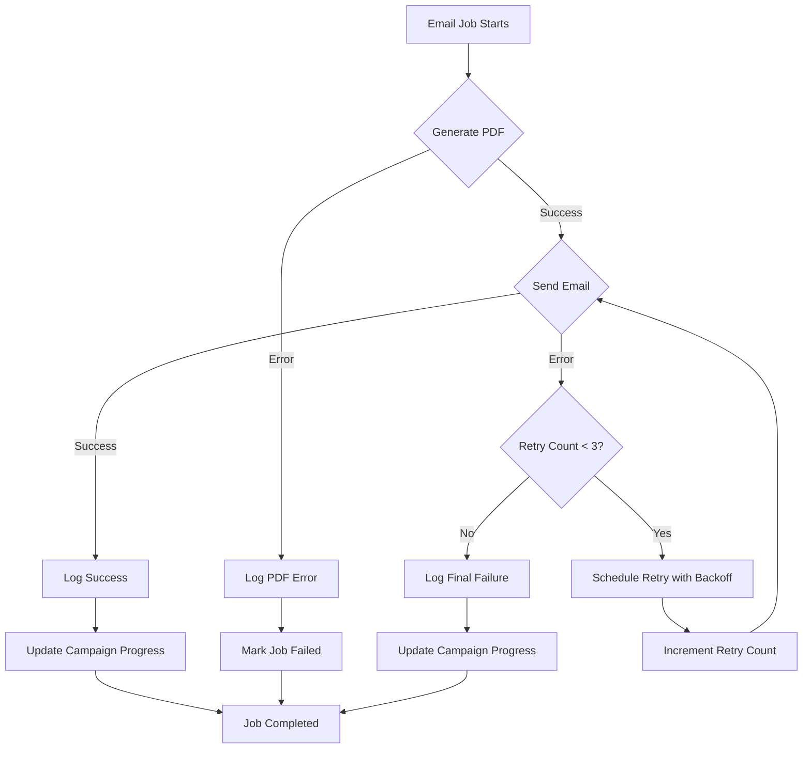
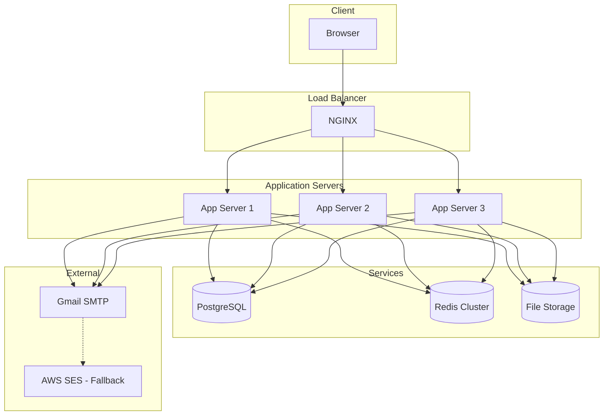

# System Architecture Diagrams

## High-Level Architecture



## Email Processing Flow



## Database Schema



## Queue Processing Flow



## API Endpoints Structure



## PDF Generation Process



## Batch Processing Logic



## Error Handling Flow



## Deployment Architecture



## Security Architecture

```mermaid
graph TB
    subgraph "Client Layer"
        C[React App]
        T[JWT Token]
    end

    subgraph "API Gateway"
        GW[Express Server]
        AUTH[Auth Middleware]
        CORS[CORS Policy]
        HELM[Helmet Security]
    end

    subgraph "Application Layer"
        CTRL[Controllers]
        SRV[Services]
        VAL[Input Validation]
    end

    subgraph "Data Layer"
        DB[(Database)]
        FS[(File System)]
        ENC[Data Encryption]
    end

    C --> GW
    GW --> AUTH
    AUTH --> CTRL
    CTRL --> SRV
    SRV --> VAL
    VAL --> DB
    SRV --> FS

    T -.-> AUTH
    ENC -.-> DB
    ENC -.-> FS

    note right of AUTH
        Validates JWT tokens
        Checks permissions
        Rate limiting
    end note

    note right of VAL
        Sanitizes inputs
        Validates schemas
        Prevents injection
    end note
```

## Monitoring and Alerting

```mermaid
graph TB
    subgraph "Application Metrics"
        AM[App Metrics]
        QM[Queue Metrics]
        EM[Email Metrics]
    end

    subgraph "Infrastructure Metrics"
        CPU[CPU Usage]
        MEM[Memory Usage]
        DISK[Disk Usage]
    end

    subgraph "External Monitoring"
        PM[Prometheus]
        GR[Grafana]
        AL[Alert Manager]
    end

    subgraph "Logging"
        EL[Error Logs]
        AL[Access Logs]
        QL[Queue Logs]
    end

    subgraph "Alert Channels"
        EM[Email Alerts]
        SL[Slack Alerts]
        SM[SMS Alerts]
    end

    AM --> PM
    QM --> PM
    EM --> PM
    CPU --> PM
    MEM --> PM
    DISK --> PM

    PM --> GR
    PM --> AL

    EL --> AL
    AL --> AL
    QL --> AL

    AL --> EM
    AL --> SL
    AL --> SM